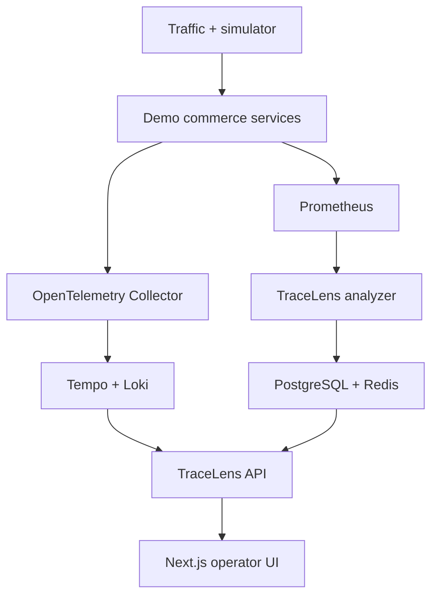
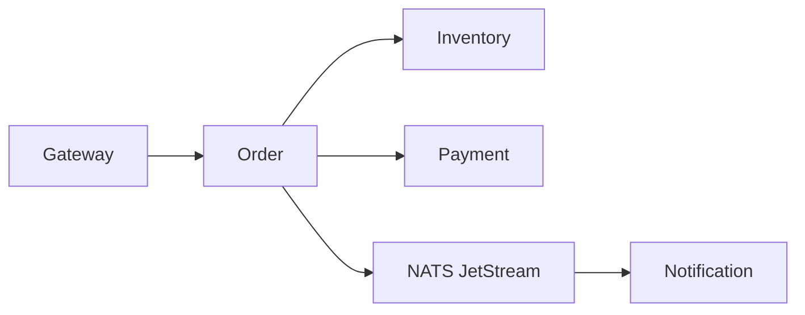

# TraceLens AI

TraceLens is a local-first incident investigation platform for distributed applications. It observes a real five-service commerce workflow, detects abnormal RED signals, correlates related anomalies, ranks probable root causes, and presents inspectable evidence in a live operator interface.

The core investigation works without an LLM. An optional model can explain the evidence pack, but it does not detect incidents or choose the root cause.

## What is genuinely implemented

- Five FastAPI demo services with synchronous and asynchronous dependencies
- NATS JetStream order events and propagated trace context
- OpenTelemetry traces and logs, plus Prometheus metrics
- Prometheus, Tempo, Loki, Grafana, PostgreSQL, and Redis
- Sliding-window signal normalization and statistical threshold detection
- Latency, error-rate, availability, and missing-telemetry anomalies
- Topology-aware incident correlation
- Deterministic root-cause ranking with a visible score breakdown
- Evidence snapshots, incident timeline, recommendations, and recovery
- Live browser updates through Server-Sent Events
- Three controlled incident scenarios that change real service behavior
- A responsive Next.js investigation interface
- Alembic migration, unit tests, API tests, scenario tests, and CI
- Windows PowerShell operations with Docker Desktop

## Architecture



The demo workload is distributed. TraceLens itself is a modular backend with a separately runnable analyzer worker. This keeps the investigation domain cohesive without manufacturing internal microservices.

## Demo request path



## Requirements for your Windows machine

- Windows 10 Pro in your **Windows 10 - Docker Mode** boot entry
- Docker Desktop running Linux containers through Hyper-V
- At least 12 GB RAM recommended
- At least 15 GB free on the drive that stores Docker data
- PowerShell 5.1 or newer

Python, Node.js, npm, WSL, and Ubuntu are not required on the host. The build toolchains run inside containers.
All configuration is baked into local images, so Docker Desktop does not need host-directory sharing for the project folder.

## Start on Windows

1. Extract this repository somewhere on `D:`. A short path such as `D:\Projects\tracelens-ai` is ideal.
2. Start Docker Desktop.
3. Open PowerShell in the repository directory.
4. If Windows blocks local scripts for this one terminal, run:

```powershell
Set-ExecutionPolicy -Scope Process Bypass
```

5. Start the complete stack:

```powershell
.\scripts\windows\Start-TraceLens.ps1
```

The first build downloads the container images and installs dependencies, so it can take several minutes. Later starts reuse the cache.

Open:

| Interface | Address | Notes |
|---|---|---|
| TraceLens | http://localhost:3000 | Main product |
| API docs | http://localhost:8080/docs | FastAPI OpenAPI |
| Grafana | http://localhost:3001 | `admin` / `admin` |
| Prometheus | http://localhost:9090 | Raw metrics |
| NATS monitor | http://localhost:8222 | JetStream state |

Allow about one minute of healthy traffic before running the first scenario. This gives the detector a useful baseline.

## Run the flagship demo

1. Open **Simulator** in TraceLens.
2. Start **Payment latency regression**.
3. Watch Payment latency rise, followed by Order and Gateway degradation.
4. Wait for the analyzer to collect two or three 10-second windows.
5. Open the incident from the overview.
6. Inspect the root-cause rank, confidence factors, signal evidence, Tempo traces, Loki logs, timeline, and simulated deployment.
7. Stop the scenario.
8. Watch the anomaly recover and the incident resolve.

The fault control is simulated. The service calls, timeouts, metrics, logs, spans, detection, correlation, ranking, and recovery are genuine runtime behavior.

## Other Windows commands

```powershell
# Status only
.\scripts\windows\Status-TraceLens.ps1

# Status plus recent application logs
.\scripts\windows\Status-TraceLens.ps1 -Logs

# Stop and preserve data
.\scripts\windows\Stop-TraceLens.ps1

# Run tests and frontend build in temporary containers
.\scripts\windows\Test-TraceLens.ps1

# Delete this project's databases and retained telemetry
.\scripts\windows\Reset-TraceLens.ps1 -ConfirmReset
```

When you want to play Valorant, stop TraceLens, shut down Windows, and choose **Windows 10 - Valorant Mode** at boot. Docker requires your separate Docker Mode because its Linux container engine needs the Windows hypervisor.

## Detection and root-cause method

Every 10 seconds the analyzer queries one-minute Prometheus windows and produces a normalized signal snapshot:

- request rate
- HTTP error rate
- p95 latency
- target availability
- sample count
- missing-data state

The detector combines absolute floors, recent baselines, minimum sample counts, and severity rules. Correlation groups anomalies by time and dependency relationship. Root-cause ranking then scores each candidate with:

| Factor | Maximum contribution | Meaning |
|---|---:|---|
| Signal strength | 0.55 | Size and confidence of the local anomaly |
| Earliest signal | 0.20 | Whether the service degraded before others |
| Upstream impact | 0.20 | Whether callers also became anomalous |
| Dependency specificity | 0.05 | Extra support for a degraded leaf dependency |

The final confidence also considers separation from the runner-up and the number of independent anomaly records. It is a transparent heuristic confidence, not a causal guarantee.

## Repository map

```text
apps/web                    Next.js operator interface
apps/tracelens_api          API, worker, domain logic, Alembic
services                    Demo commerce services and shared telemetry
infra                       Collector and telemetry backend configuration
scripts/windows             Windows-first operations
tests                       Unit, API, and scenario tests
docs                        Architecture, demo, decisions, and interview notes
docker-compose.yml          Complete local environment
```

## Optional AI explanation

Leave `AI_PROVIDER=disabled` for the deterministic explanation. To use an OpenAI-compatible chat endpoint, edit `.env`:

```dotenv
AI_PROVIDER=openai-compatible
AI_BASE_URL=https://your-provider.example/v1
AI_API_KEY=replace-locally
AI_MODEL=your-model
```

The model receives a structured evidence pack and ranked hypotheses. Provider failure falls back to the deterministic explanation. Never commit `.env`.

## Resource and retention choices

This is a local portfolio environment, not a production telemetry cluster. Prometheus, Tempo, and Loki retain approximately two hours of local data. Redis is capped at 128 MB. Docker named volumes preserve state across ordinary stops. These choices keep the full environment practical on a 16 GB workstation and a drive with limited free space.

## Important limitations

- One local environment and no authentication
- No multi-tenancy, alert routing, or automated remediation
- Fixed topology catalog augmented by runtime metrics, not full topology discovery
- Rule-based anomaly detection, not trained machine learning
- Heuristic probable cause, not proof of causation
- Short telemetry retention and local filesystem storage
- Controlled traffic and incident patterns
- Container resource metrics are not part of the initial detection model

See [architecture](docs/architecture.md), [data engineering](docs/data-engineering.md), [demo guide](docs/demo-guide.md), [Windows troubleshooting](docs/windows-troubleshooting.md), and [interview guide](docs/interview-guide.md).

## License

MIT
