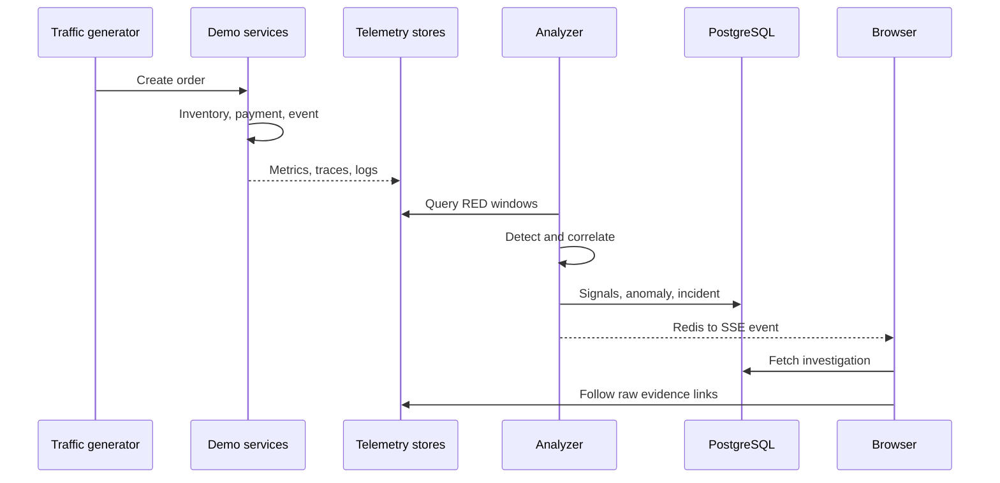
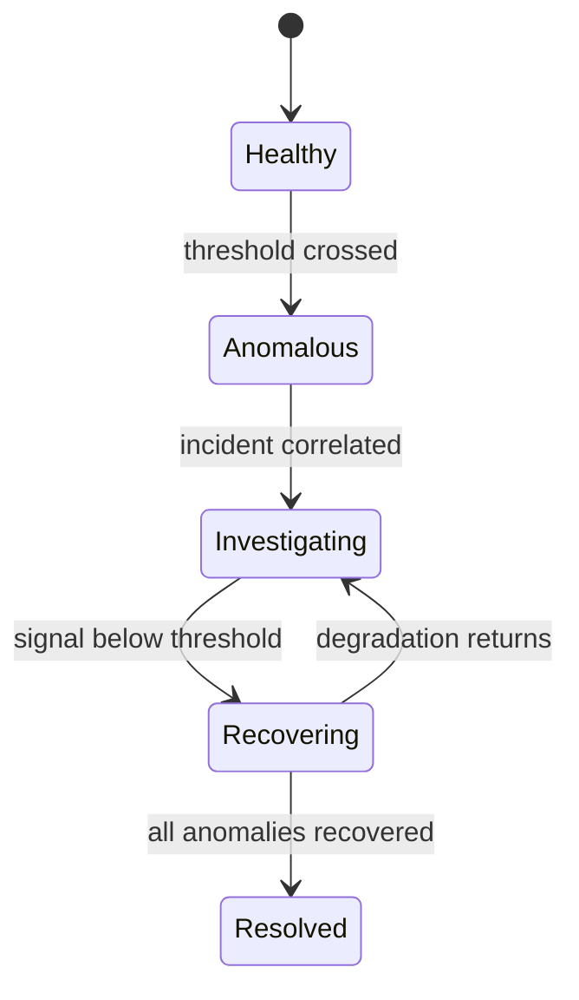

# TraceLens Architecture

## Product boundary

TraceLens does not store raw telemetry itself. Prometheus stores metrics, Tempo stores traces, and Loki stores logs. TraceLens stores processed signals and investigation state in PostgreSQL, then keeps short-lived live events in Redis.

## Layers

| Layer | Components | Responsibility |
|---|---|---|
| Workload | Gateway, Order, Inventory, Payment, Notification, traffic generator, NATS | Produce meaningful service behavior and failure propagation |
| Telemetry | OTel SDK, Collector, Prometheus, Tempo, Loki, Grafana | Collect, retain, query, and validate raw operational data |
| Investigation | Analyzer, detection, correlation, ranking, evidence, lifecycle | Turn signals into an explainable incident |
| Presentation | FastAPI, SSE, Next.js | Present live health and investigation workflows |

## Runtime data flow

## Failure and recovery states

## Why a modular backend

The TraceLens API and analyzer share one domain model and database but run as separate processes. This separates request latency from telemetry analysis while avoiding network boundaries inside tightly coupled investigation logic. A production system could extract workers later if throughput or ownership demands it.

## Consistency and failure behavior

- PostgreSQL is authoritative for incidents and evidence snapshots.
- Redis events are invalidation hints. The browser always refetches authoritative state.
- Prometheus, Tempo, and Loki failures produce missing or partial evidence states.
- AI provider failure cannot stop incident detection or ranking.
- Fault injection is available only when `SIMULATOR_ENABLED=true`.
- Startup uses an Alembic migration before API readiness.
