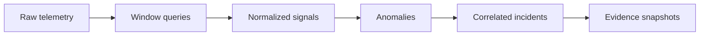

# Data Engineering Notes

## Raw and processed telemetry

Raw telemetry remains in specialized backends. The analyzer queries fixed one-minute windows every ten seconds and writes a compact `signal_snapshots` row per service. This is a deliberate transformation pipeline:

## Schemas

- `signal_snapshots`: normalized RED values and freshness
- `anomalies`: threshold breach, score, baseline, and measured evidence
- `incidents`: lifecycle, probable root cause, confidence, impact, recommendations
- `incident_events`: ordered investigation and recovery timeline
- `deployments`: change context, including explicitly labeled simulated events
- `services`: catalog and expected dependencies

## Window and baseline choices

- Prometheus query window: 60 seconds
- Analysis frequency: 10 seconds
- Baseline: latest 12 valid processed windows
- Minimum request samples for rate and latency alerts: 8
- Correlation tolerance: 180 seconds

Overlapping windows make the dashboard responsive but mean adjacent samples are not statistically independent. Confidence is therefore a heuristic score and not a calibrated probability.

## Indexes

Time and lookup indexes cover service snapshots, active anomaly lookup, incident status updates, incident timelines, and deployment correlation. JSON columns hold explainability details that vary by detector while relational keys protect the core lifecycle.

## Retention

Raw local telemetry retains about two hours. Investigation rows remain in PostgreSQL until the project is reset. A production design would add partitioning, evidence retention policies, object storage, and tenant boundaries.
